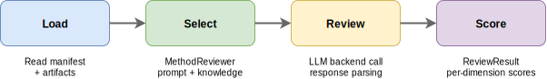
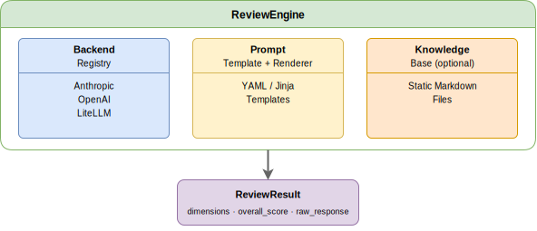

# Design: Agentic Review Assistant

## Motivation

Upstream pipeline stages produce structured artifacts — point estimates,
confidence intervals, model diagnostics — that require expert judgement to
interpret. Is the effect estimate plausible? Is the model type appropriate for
the data? Are the diagnostics healthy?

The evaluate package provides a general-purpose agentic review layer that
accepts any job directory conforming to the manifest convention, producing
structured, auditable review judgements. A lightweight deterministic scorer
(`score/scorer.py`) is included for debugging, testing, and illustration — it
assigns a confidence band based on methodology type alone without examining
the content of the results.



## Architecture overview



## Components

### Symmetric Evaluate adapter

The `Evaluate` pipeline component uses symmetric strategy dispatch.  Both
strategies share the **same flow** — only the confidence source differs:

```
manifest → reviewer → scorer_event → [confidence source] → EvaluateResult → write → return
```

1. `evaluate_strategy` (from `manifest.json`) → *how* to compute confidence
   (score vs review)
2. `model_type` → selects the `MethodReviewer` (single source of truth for
   confidence range, prompt templates, knowledge, artifact loading)

Both strategies construct the same `EvaluateResult`, write
`evaluate_result.json` to the job directory, and return the same 8-key
output dict for downstream ALLOCATE. The manifest is treated as read-only.

Each strategy also writes its own strategy-specific result file:
- Score: `score_result.json` (`ScoreResult` — confidence + audit fields)
- Review: `review_result.json` (`ReviewResult` — dimensions + justifications)

`MethodReviewer` provides a default `load_artifact()` implementation (reads
all manifest files, extracts `sample_size` from JSON).  Subclasses override
only when they need method-specific loading.

| File | Role |
|------|------|
| `models.py` | `EvaluateResult` dataclass (shared stage output) |
| `score/scorer.py` | `ScoreResult` dataclass + `score_confidence()` — seeded by `initiative_id` |
| `job_reader.py` | `load_scorer_event(manifest, job_dir)` — reads `impact_results.json` and builds a flat scorer event dict |
| `adapter.py` | `Evaluate` PipelineComponent — symmetric dispatch, shared `EvaluateResult` construction and I/O |

### Review subsystem

| File | Role |
|------|------|
| `review/models.py` | Data models: `ReviewResult`, `ReviewDimension`, `ReviewResponse`, `ArtifactPayload`, `PromptSpec` |
| `review/engine.py` | `ReviewEngine` — orchestrates a single review: load prompt, render template, call `litellm.completion()` with structured output |
| `review/api.py` | Public `review(job_dir)` function — end-to-end review of a job directory |
| `review/manifest.py` | `Manifest` dataclass + `load_manifest()` (read-only) |
| `review/methods/base.py` | `MethodReviewer` base (default `load_artifact`) + `MethodReviewerRegistry` |
| `review/methods/experiment/` | Experiment (RCT) reviewer with prompt templates and knowledge |
| `config.py` | `ReviewConfig` — loads from YAML/dict/env vars |

### LLM backend

The review engine calls `litellm.completion()` directly with a Pydantic
`response_format` (`ReviewResponse`), producing structured JSON that maps
directly to dimension scores and an overall score. LiteLLM wraps 100+
providers, so any model supported by LiteLLM can be used by setting the
`model` field in config.

### Registry pattern

The method reviewer dimension uses decorator-based registration:

## Data flow

### Pipeline context

The orchestrator pipeline flows:

```
MEASURE ──► EVALUATE ──► ALLOCATE ──► SCALE
```

The orchestrator passes a job directory reference to `Evaluate.execute()`:

| Field | Type | Description |
|-------|------|-------------|
| `job_dir` | str | Path to the job directory containing `manifest.json` |
| `cost_to_scale` | float | (optional) Override for cost from the orchestrator |

The manifest's `evaluate_strategy` field (default: `"review"`) controls
the confidence source.  Both strategies share the same symmetric flow:
read manifest, select reviewer, load scorer event, compute confidence,
construct `EvaluateResult`, write `evaluate_result.json`.

The `evaluate_strategy` field in `manifest.json`:
- `"score"` — seeded random draw from `confidence_range` (debug/test), writes `score_result.json`
- `"review"` — LLM review via `ReviewEngine`, confidence = `overall_score`, writes `review_result.json`

### Scorer event contract

`load_scorer_event()` reads flat top-level keys from `impact_results.json`:

```json
{
  "ci_upper": 15.0,
  "effect_estimate": 10.0,
  "ci_lower": 5.0,
  "cost_to_scale": 100.0,
  "sample_size": 50
}
```

The review path reads the same file as raw text via
`reviewer.load_artifact()`, so the full measure output (nested model params,
diagnostics, etc.) is preserved for the LLM reviewer even though the scorer
only uses the flat keys above.

### Score output

```python
@dataclass
class ScoreResult:
    initiative_id: str
    confidence: float              # deterministic draw
    confidence_range: tuple[float, float]  # bounds used
```

### Review input

The `ArtifactPayload` envelope:

```python
@dataclass
class ArtifactPayload:
    initiative_id: str
    artifact_text: str       # serialized upstream results
    model_type: str          # methodology label
    sample_size: int
    metadata: dict           # additional context
```

### Review output

```python
@dataclass
class ReviewResult:
    initiative_id: str
    prompt_name: str         # which template was used
    prompt_version: str
    backend_name: str        # which LLM backend
    model: str               # which model
    dimensions: list[ReviewDimension]  # per-axis scores
    overall_score: float     # aggregated (mean of dimensions)
    raw_response: str        # full LLM output for audit
    timestamp: str           # ISO-8601
```

## Prompt template contract

Templates are YAML files with Jinja2 content:

```yaml
name: impact_results_review       # unique identifier
version: "1.0"                     # pinned for reproducibility
description: "Review impact measurement results"
dimensions:                        # scoring axes
  - estimate_plausibility
  - statistical_rigor
  - methodology_fit

system: |                          # Jinja2 system message
  You are a methodological reviewer...
  {{ knowledge_context }}

user: |                            # Jinja2 user message
  {{ artifact }}
  Model type: {{ model_type }}
```

The engine uses LiteLLM's `response_format` with a Pydantic model
(`ReviewResponse`) to get structured JSON output directly from the LLM.
The response maps to dimension scores and an overall score without any
text parsing.

## Configuration

A single YAML file or dict configures the backend:

```yaml
backend:
  model: claude-sonnet-4-5-20250929
  temperature: 0.0
  max_tokens: 4096
```

Environment variable overrides: `REVIEW_BACKEND_MODEL`,
`REVIEW_BACKEND_TEMPERATURE`, `REVIEW_BACKEND_MAX_TOKENS`.

## Dependency strategy

| Component | Core dependency |
|-----------|----------------|
| Scorer, models | `numpy` |
| LLM completions | `litellm` |
| Template rendering | `jinja2` |
| Config / prompt loading | `pyyaml` |

All review dependencies (`litellm`, `jinja2`, `pyyaml`) are core
requirements in `pyproject.toml`.

## Future directions

- **Rich artifact bridge**: Structured formatter that serializes complex
  upstream output (DataFrames, JSON, config) into reviewable text. Format TBD.
- **Vector knowledge base**: Wrap external vector stores (ChromaDB, Pinecone)
  for semantic retrieval of methodology references.
- **Multi-pass review**: Chain multiple prompts (study design → data quality →
  impact results) and aggregate into a composite review.
- **Review caching**: Cache reviews by content hash for reproducibility and
  cost control.
